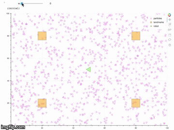
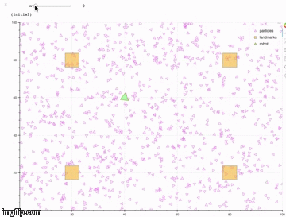

# Particle Filter Projects
# [1. Kidnapped Vehicle](./kidnapped-vehicle/README.md)
- A particle filter implementation to track a kidnapped robot.
- See also [Jupyter Notebooks here](https://github.com/mithi/rusty-genes/tree/rusty-genes/particlefilter)
- [Slides of Lecture I've delivered Here](https://github.com/mithi/love-letters/blob/master/w8/Particle%20Filters%20Lecture.pdf)

| Perfect Observation | Noisy Observation |
| ----------------------------- |:-------------------------------:|
|  | |

# 2. A particle-filter visualization
- Particle Filter Visualization  in Python using [Bokeh](bokeh.pydata.org) based on [Udacity's free A.I. for Robotics course](https://www.udacity.com/course/artificial-intelligence-for-robotics--cs373)

